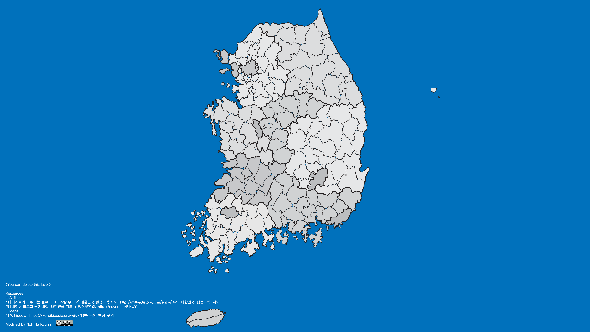

# SouthKoreaProvincesMapIllustrator
Adobe Illustrator map of South Korean Provinces

Original source from [뿌리는블로그크리스탈뿌리오](http://mittya.tistory.com/entry/%EC%86%8C%EC%8A%A4-%EB%8C%80%ED%95%9C%EB%AF%BC%EA%B5%AD-%ED%96%89%EC%A0%95%EA%B5%AC%EC%97%AD-%EC%A7%80%EB%8F%84)

Illustrator file created and edited in Adobe CC 2015 Illustrator.

## Some layers of layer titles may not appear correctly in lower version of Illustrator!

# Using Illustrator file for editing

- Version 1

  0. Master Layer

    - Cities

        - Provinces Layout(Stroke)

        - Provinces (Shape areas)
        
        
 - Version 2

  1. Layout of Cities and Provinces

  2. Cities

        - Provinces (Shape areas)

## Screenshot

