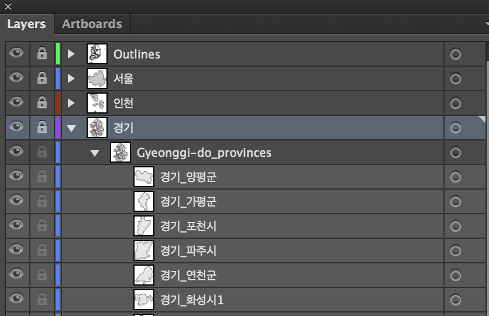

# SouthKoreaProvincesMapIllustrator
Adobe Illustrator map of South Korean Provinces

Original source from [뿌리는블로그크리스탈뿌리오](http://mittya.tistory.com/entry/%EC%86%8C%EC%8A%A4-%EB%8C%80%ED%95%9C%EB%AF%BC%EA%B5%AD-%ED%96%89%EC%A0%95%EA%B5%AC%EC%97%AD-%EC%A7%80%EB%8F%84)

Illustrator file created and edited in Adobe CC 2015 Illustrator.

## Some layers or layer titles may not appear correctly in lower versions of Illustrator!

# Using Illustrator file for editing

- Version 1

  0. Master Layer

    - Cities

        - Provinces Layout(Stroke)

        - Provinces (Shape areas)
        
        
 - Version 2

  1. Layout of Cities and Provinces

  2. Cities

        - Provinces (Shape areas)

**No attribution required**

=====================================================

서울대학교 언어학과 역사비교언어학 발표자료 준비를 위해 제작한 파일입니다.

[뿌리는블로그크리스탈뿌리오](http://mittya.tistory.com/entry/%EC%86%8C%EC%8A%A4-%EB%8C%80%ED%95%9C%EB%AF%BC%EA%B5%AD-%ED%96%89%EC%A0%95%EA%B5%AC%EC%97%AD-%EC%A7%80%EB%8F%84)에 업로드된 일러스트 파일을 편집한 것입니다.

시와 구 단위 별로 묶어 레이어로 편집하였습니다.

## 실제 지도와 100% 일치하지는 않습니다

파일은 [Ver 2.0](https://github.com/andrew-noh/SouthKoreaProvincesMapIllustrator/tree/master/Ver%202.0) 폴더 안에 있습니다.

## 레이어 구조

## 색상 변경 방법:

### *1. 레이어 선택*

### *2. 선택 완료*

### *3. 레이어 색상 변경*

Adobe CC 2015 버전에서 하위 호환 버전으로 저장하였으나, 하위 버전에서 온전히 호환되지 않을 수 있습니다.

## Screenshot

